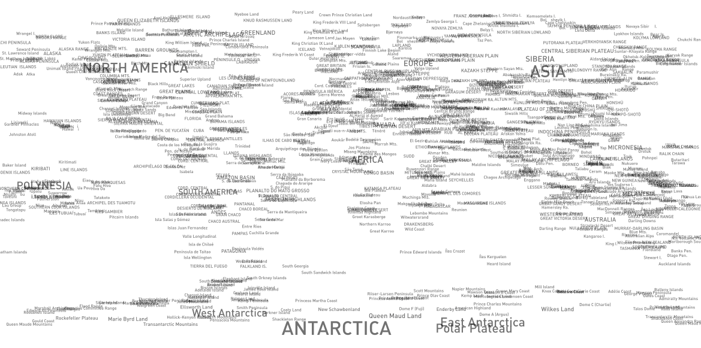

# OpenGeographyRegions
A project to create a free, global, crowdsourced, multilingual dataset of geographic regions.

**This is work in progress, pull requests and other input are welcome.**

Just draw a geographic region you know and add a reference to wikipedia. A basic geojson editor can be found at [geojson.io](http://geojson.io/).

## Simple polygons, appropriate for different scales.
Starting with [natural earths](https://www.naturalearthdata.com/) 10m geography dataset. There are currently 1052 features.

## Linked Data (permits internationalization and semantics through integration with other datasets)
Add a property "wikidata" with value "Q23" to reference a wikidata object.

## Open License
The license is CC0.

## Data in GeoJSON
The data is available in GeoJSON. 

### geography_10m.geojson features in feature classes
Currently used feature classes (and usage count), derived from natural earth:
* 165 "archipel"
*   9 "basin"
*  37 "coast"
*   7 "continent"
*  12 "delta"
*   2 "depression"
*  58 "desert"
*   3 "foothills"
*  44 "geoarea"
*   3 "gorge"
* 295 "island"
*   4 "isthmus"
*   3 "lake"
*   5 "lowland"
* 222 "mountain_range"
*  68 "peninsula"
*  30 "plain"
*  72 "plateau"
*   4 "tundra"
*   6 "valley"
*   3 "wetlands"

The statistics are printed quick + dirty with this bash line: `cat geography_10m.geojson |cut -f 9 -d" "|sort|uniq -c`

### Editing conventions
Only use spaces, 2 spaces for each indentation level. Do not break the *geometry* value into lines so that the file becomes easier readable.
#### Properties
Stick to this property ordering to avoid unnecessary history cluttering.
* name
* namealt
* featureclass
* scalerank *(not sure this is needed, might be removed in a following version)*
* region
* subregion
* wikidata

#### Regions
* Africa
* Antarctica
* Asia
* Europe
* North America
* Oceania
* South America
* Seven seas (open ocean)

